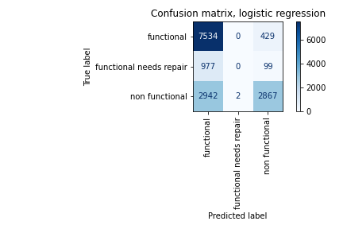
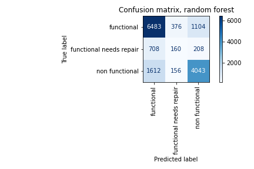
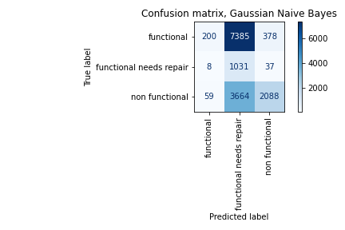
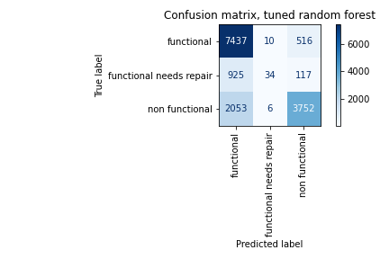

# Predictive Modeling of Tanzanian Water Well Functionality

**Author:** Nancy Ho

## Overview

This predictive analysis was performed with the goal of providing a way to predict the functionality of water wells in Tanzania for those who may need to use it (non-profit charity groups, public works officials, etc) for the upkeep of existing water wells. Using machine learning classifiers from the [scikit-learn](https://scikit-learn.org/stable/index.html) library, we create a model that will help us predict the condition of water wells based on their information.

## Business Problem

The ongoing water crisis in Tanzania has made it difficult for the people in its villages to obtain clean, sanitary water, and in recent years an increasing number of non-profit organizations have pooled donations across the globe towards an effort to provide water sources for these villages. Thousands of wells have been drilled in Tanzania so far, and many more continue to be developed across the continent. 

While planning out the best locations to drill new wells is the best way to ensure more Tanzanians have access to clean water, the process of drilling new wells is extensive and requires a large amount of resources, finances, and labor. It's also important to ensure that the wells that are already present are functional in the meantime so that villages have sustainable access to clean water. By also figuring out how to allocate the necessary  funds and labor necessary to perform maintenance work on pre-existing wells, we can ensure that new wells can be drilled without unnecessarily neglecting others.

Using the scikit-learn machine learning library, we will test out models that will allow us to predict the condition of water wells in Tanzania based on information about these wells such as when they were constructed, the extraction methods utilized, etc. While the main focus of this analysis will be Tanzanian water wells, this may also provide the foundation for a predictive model that can be applied to water wells across the rest of the African continent.

## Data

We will be using data on water wells in Tanzania provided by [DrivenData](https://www.drivendata.org/competitions/7/pump-it-up-data-mining-the-water-table/page/23/) from Taarifa and the Tanzanian Ministry of Water, which can be found in the repository's `data` folder. More information about each value in this dataset can be found on the "Problem Description" tab of the competition page, found [here](https://www.drivendata.org/competitions/7/pump-it-up-data-mining-the-water-table/page/25/).

## Methods

Since the data is pre-split into labels representing each well in the data and values relating to each well, I import both datasets and join them by the `id` column to investigate the data. The dataset contains many attributes about each water well, many of which are irrelevant to  the condition of Tanzanian water wells, so I remove any columns that would potentially have little effect on our models later on. I also remove columns that contain redundant information about subgroups of attributes of each well; I choose to keep the "group" variables instead of more specific columns since this model is intended to predict the condition of a well based on broad details for now.

As we can see from the figure above, these classes are imbalanced. which may cause our models to become more biased towards the majority class, functional. While we could merge the functional needs repair entries into the non functional class, I believe that it is important to distinguish a functioning well in need of repair from an outright non-functional one. Depending on what resources are available to us, we might choose to perform maintenance on wells that need repair before working on non-functional wells, or vice versa. Therefore, I will proceed with creating our models with the data as is, keeping in mind that there is a possibility our data will be biased towards predicting functional wells instead.

## Model Creation and Evaluation

Before I create our predictive models, I split the data into training and test sets so that we have a set of data to train our models with, while holding out a subset of our data that we use to evaluate the performance of our model later on.

Our first model will use the [LogisticRegression](https://scikit-learn.org/stable/modules/generated/sklearn.linear_model.LogisticRegression.html) classifier. Normally this is designed for binary classification, but for our purposes we will include the `multinomial` argument so that we can perform classification on all our classes. Once we create a pipeline from scikit-learn's `Pipeline` module and fit the model on the training data, we can start evaluating our model in two ways. 

Before evaluating it against our holdout test data, we measure the performance of our model using cross-validation, which splits the training set into smaller subsets and tests the model among the rest of the data, using scikit-learn's [cross_val_score](https://scikit-learn.org/stable/modules/generated/sklearn.model_selection.cross_val_score.html) function. Then to measure the performance of our model against our test data, I use the [f1_score](https://scikit-learn.org/stable/modules/generated/sklearn.metrics.f1_score.html) as our primary metric, which will give us a general idea of how effectively our model can identify the status of a well without falsely classifying it under the wrong status (i.e. identifying a non functional well as functional). Overall, our F1 score of 0.70 gives us about the same result as our cross-validated score, the only significant difference being that the F1 score is averaged across our three classes. 

To gain a better idea of how well our model can distinguish between classes, we can also use a confusion matrix to see how often our model identified wells under their true labels against the labels our model predicted. Even though this model seems to have performed well, overall this model misclassifies a majority of wells as functional; the class imbalance in the data may have caused this bias in our model.


Our next model utilizes the [Random Forest](https://scikit-learn.org/stable/modules/generated/sklearn.ensemble.RandomForestClassifier.html) classifier, which fits and averages subsets of decision tree classifiers to improve the accuracy of our model and prevent overfitting of our data. This model slightly outperforms our logistic regression model, as we see higher cross-validated scores and a higher F1 score of 0.72. Its improved performance also reflects in its confusion matrix; it was able to identify more non-functional and functional needs repair wells than our first model! 


Unfortunately, this classifier seems to perform significantly worse than our first two models. The confusion matrix also shows a less than ideal performance of the Naive Bayes model, showing us that it identified most of our water wells as "functional needs repair" with no regard to whether it was actually functional or non-functional.


It seems that our random forest model performed the best in predicting whether a well was either "non functional" or "functional needs repair", scoring the highest of our three models. We thenperform hyperparameter tuning on this model to find the optimal parameters with which we can train it with. We create a parameter grid of test values to use on our model and then use [GridSearchCV](https://scikit-learn.org/stable/modules/generated/sklearn.model_selection.GridSearchCV.html) to search through the given test parameters that will allow the best performance from our model. We were able to identify parameter values that ended up improving our Random Forest classifier's performance, increasing our F1 score to 0.75; however, this model also shows a more significant bias than our first one towards identifying functional wells.


## Conclusion

Of the three models that we trained using our data, the random forest model performed the best, as it was able to minimize the amount of error in misclassifying the condition of each well with a F1 score of 0.72. Using this knowledge, we were able to find optimized parameters for our model to further improve the accuracy the model; with these new parameters, our F1 score increased to 0.75.

While this model does not perform exceptionally well in correctly identifying which wells need repair, with an averaged precision and recall score of 0.75, it is satisfactory in providing us with a model that can predict the condition of wells through general information made available about them. As the water crisis in Tanzania continues, we can use this model as a starting point to create more complex models later on to better identify and prioritize the work that needs to be done to ensure Tanzanian villages continue to have sustainable access to clean water.

### Next Steps

In the future, if we wanted to adjust the models to plan for new and pre-existing wells more effectively, there are several steps we can take:
- Attempt re-training our models with more balanced data, since many of our models were affected by the bias caused by class imbalance in our data. If we aren't interested in discerning functional from non-functional wells to determine whether to repair them, we could merge the amounts in the `functional needs repair` and `non functional` classes and see if that provides a more accurate model.
- For the sake of simplicity and performance, these models do not include specific subtypes of the attributes included (e.g. extraction types). We could create a model in the future for each attribute that takes these subtypes into account, possibly to gain a better understanding of which wells need repair.
- Doing more research on geological and ecological factors that might impact the performance and condition of water wells may also help us plan the process of performing work on Tanzania's water wells. Water quality is also important to providing sanitary water to villages, and involves many other factors beyond the scope of what is covered in this dataset.
- If we want to broaden our model to accomodate for wells across Africa, we can run our best model again provided data on water wells from other regions in Africa.


## For More Information

You can review the full analysis in the [Jupyter Notebook](./tanzania-well-analysis.ipynb) or the [presentation](./tanzania-well-analysis-presentation.pdf)

For any additional questions, please contact **Nancy Ho** at [nancyho83@yahoo.com].

## Sources

Data source: 
[DrivenData Competition Pump it Up: Data Mining the Water Table](https://www.drivendata.org/competitions/7/pump-it-up-data-mining-the-water-table/page/23/)

[Scikit-learn library and official documentation](https://scikit-learn.org/stable/index.html)

Research on water sanitation in Tanzania/Africa:
<br>[water.org, Where We Work: Tanzania](https://water.org/our-impact/where-we-work/tanzania/)</br>
<br>[LifeWater, The Tanzania Water Crisis: Facts, Progress, and How to Help](https://lifewater.org/blog/tanzania-water-crisis-facts/)</br>

## Repository Structure
```
├── README.md                                            <- Top-level README for reviewers of this project
├── Tanzania_Water_Well_Analysis.ipynb                   <- Narrative documentation of analysis in Jupyter notebook
├── Tanzania_Water_Well_Analysis_Presentation.pdf        <- PDF version of project presentation
├── data                                                 <- Both sourced externally and generated from code
└── images                                               <- Both sourced externally and generated from code
```